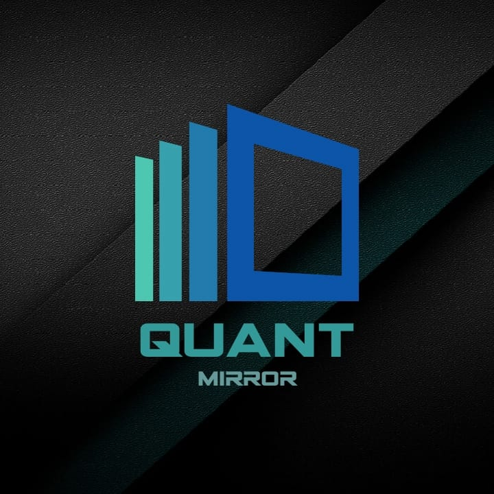

<h2 style="color: #193967; text-align: center">
    Upskilling Curriculum
</h2>

<h4 style="color: #193967; text-align: center">
    Kabelo Masemola < kabelo.masemola@quantmirro.io>  
    Bongani Mondlane < bongani.mondlane@quantmirror.io>  
    Edmond Monyebodu < edmond.monyebodu@quantmirror.io >  
</h4>

<h3 style="color: #193967;" >Content</h2>
<ol>
    <li>Introduction</li>
    <li>Fundamentals of data driven systems
        <ol>
            <li>Relational database systems
                <ol>
                    <li><a href="fun_data_driven_systems/relational_data_model.md">Relational data model</a></li>
                    <li><a href="fun_data_driven_systems/database_schema.md">Schema</a></li>
                    <li><a href="fun_data_driven_systems/database_keys.md">Keys</a></li>
                    <li><a href="fun_data_driven_systems/database_views.md">Views</a></li>
                    <li><a href="fun_data_driven_systems/database_joins.md">SQL Joins</a></li>
                    <li><a href="fun_data_driven_systems/database_transactions.md">Transactions in sql</a></li>
                    <li><a href="fun_data_driven_systems/database_commits.md">Commits</a></li>
                </ol>
            </li>
            <li> No SQL systems
                 <ol>
                  <li> <a href="fun_data_driven_systems/nosql_schema.md">Extended Schema discussions</a></li>
                  <li> <a href="fun_data_driven_systems/nosql_schemaless.md">Schemaless systems</a></li>
                  <li> <a href="fun_data_driven_systems/nosql_what_is.md">What is Nosql</a></li>
                  <li> <a href="fun_data_driven_systems/nosql_types.md">Types of nosql storage system</a></li>
                  <li> <a href="fun_data_driven_systems/nosql_applications.md">Applications of nosql </a></li>
                  <li> <a href="fun_data_driven_systems/nosql_examples.md">Popular examples</a></li>
                 </ol>
            </li>
            <li>Data processing Concepts
                <ol>
                    <li><a href="data_processing_concepts/batch_vs_streaming.md">Batch vs Streaming</a></li>
                    <li><a href="data_processing_concepts/lambda.md">Lambda architecture</a></li>
                    <li><a href="data_processing_concepts/parallel_processing.md">Parallel processing</a> 
                        <ol>
                        <li><a href="data_processing_concepts/threading.md">Multi Threading</a></li>
                        <li><a href="data_processing_concepts/multi_processing.md">Multi-Processing</a></li>
                        <li><a href="data_processing_concepts/distributed_system.md">Distributed Systems</a></li>
                        <li><a href="data_processing_concepts/resiliency.md">System Resiliency</a></li>
                        </ol>
                    </li>
                    <li>Popular systems
                     <ol> 
                        <li>Apache Kafka</li>
                        <li>Apache Spark</li>
                        <li>Apache Hadoop</li>
                        <li>Ray</li>
                        <li>Dask</li>
                        <li>Apache storm</li>
                     </ol>
                    </li>
                </ol>
            </li>
        </ol>
    </li>
</ol>

<h3 style="color: #193967;" >Introduction</h2>

There is a theory which states that if ever anyone discovers exactly what the Universe is for and why it is here, 
it will instantly disappear and be replaced by something even more bizarre and inexplicable.
There is another theory which states that this has already happened.An interesting statement originally posed for humorous intent; but how do we prove or disprove any theory whether outright comical or somewhat plausible?
Well we dedicate time examining the proposed subject against some accepted factoids and empirical evidence.
Simple as this is proposed the methodologies needed to do this are in no way non-trivial, 
we require scientific rigour and properly formed techniques to properly joust with the most complex of this universe's problems. The intent of the internship programme is to groom the 
next wave of data experts to tackle these such problems. 

Each successful alumna of this programme will possess the following skills:
1. Project management 
- Requirements analysis
- Work scheduling
- Effective time management
- Project delivery and handover management 

2. Analytics 
- Data sight-reading 
- Reporting skills 
- Anomaly reporting 
- Descriptive analysis
- Predictive analysis
- Machine learning 

3. Quantitative skills 
- Intuitive understanding of calculus 
- Intuitive understanding of liner algebra 
- Intuitive understanding of advanced geometry
- Intuitive understanding of regressive methods 
- Deep and  advanced understanding of classification for financial and engineering systems 

4. Software Engineering 
- Design Patterns
- Software architecture
- Micro service systems 
- Sambe specific product offerings 
- Advanced python programming
- Advanced Golang programming 
- Advanced JVM Based programming

5. Data engineering
- ETL 
- Stream processors 
- System SLA 
- Hyper resilient design

6. Product design
- Design thinking 
- Feasibility studies 
- Market research
- Team building 
- and successful deployment

These skills are perfect to bootstrap an  analyst's career, as a full stack data professional. Welcome and enjoy the ride !!

