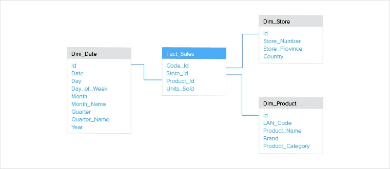

<h2 style="color: #193967; text-align: center">
    Extended Schema discussions
</h2>

<h4 style="color: #193967; text-align: center">
    Kabelo Masemola < kabelo.masemola@sambe.co.za>
</h4>

#### Data schema 

We previously discussed a RDBMS schema as a  logical configuration
of all or part of a relational database. The idea of a schema extends far beyond RDBMS schemas. 
we also have different schema style in RDBMS for different applications,e.g a star schema is reserved for warehousing applications.

In this section we will attempt to discuss other types of schemas before we can delve into the wild west of schemaless systems. We will discuss 6 designs:
1.The **flat model**  is for small, simple applications 
2. The **hierarchical model** is for nested data, like **XML** or **JSON**
3. The **network model** is useful in mapping and spatial data, also for depicting workflows
4. The **relational model** best reflects Object-Oriented Programming applications (this is the schema we have discussed )
5. The **star schema** is for analyzing large datasets
6. The **snowflake schema** is for analyzing large datasets

Choosing the correct database schema can ease a lot of anguish and heartache throughout
the life of a software project. An incorrect schema design can lead to terrible bottlenecks in an application 
and can be costly to refactor.For example, if you didn't realize early on that your application would rely on several table JOINs, 
your service will eventually grind to a halt when you reach a certain 
number of users and data.  To resolve this, data will likely have to move to new tables, code will have to point to those new tables,
and then those tables will have to have the proper JOINs.This means that you will need a very strong test environment (database and source code)
to test your changes in, you will need a plan to manage data integrity, and a plan for updating your database
and source code at the same time. Most importantly, once you start migrating your database to a new schema, there is almost no turning back.

### Flat model

A flat model schema is a single, two-dimensional array where elements in each column are the same type of data,
and elements in the same row relate to each other. Think of this as a single Excel spreadsheet, 
or a single database table with no relations. These are best for simple, small applications that don't 
have too much data or complex relations. For example, if you run a small business with a handful 
of employees, and you wish to store their salary information, a single, flat data model will suffice.
This model abides by the
 

 

### Hierarchical Model
Hierarchical models have a tree-like structure, with a "root" node of data and child nodes that branch out from that root.
There is a one-to-many relationship between parent and child nodes. This type of data schema is best reflected in XML or JSON files, 
where an entity can have sub-entities which are not shared with other entities.
 
Hierarchical models are great for storing nested data. For example, the study of taxonomy relies on a hierarchical dataset: Kingdom, Phylum, 
Class, Order, Family, Genus, and Species. If you are reading this, you are likely a member of the Genus-Species Homo Sapiens. 
There are other members of the Homo Genus - **Homo neanderthalensis**, for example - but our species does not exist in any other genus.
 
From a database perspective, one would need to look for "triple stores". A triple-store is a
type of database which stores data in the form of "triples."
A "triple" is a record of data made up of a subject, predicate, and object (in that order).
 

 

### Network Model

The network model is like the hierarchical model in that it represents a series of nodes and vertices, however, 
it allows for many-to-many relationships. From a theoretical standpoint, this means that the graph can have cycles. 
A cycle in graph indicates that there is a path of vertices in which you can start and end at the same node. 
This is a very important distinction, as it will tell you the bounds in which your application can run.
If your software does not expect any cycles, but one exists in your data, you can unexpectedly run your software through that cycle forever.
 
There's a classic problem in Computer Science and Graph Theory called "The Traveling Salesman" it goes as follows:

**Given a list of cities and the distances between each pair of cities,
what is the shortest possible route that visits each city exactly once and returns to the origin city?**

This type of question is being asked by thousands of companies each day, 
for the correct answer is a keystone to success for any logistics company. Billions of dollars lie in a company's ability to efficiently 
move their goods from point A to point B, and thus, a deep understanding of how to apply the network model is vital.
Most applications that need spatial calculations would likely benefit from having data stored inside of a network-modeled database. 
GIS, Geographic Information Systems, are software that enable users to efficiently store and analyze mapping data.

A network model is also useful when depicting workflows, especially when there are multiple paths to the same result.
Take a restaurant chain, for example. A typical workflow is the server tells the cook what to make, let's say "a burger with fries." 
The cook will whip up a delicious hamburger with all the fixins, fry up a salty batch of french fries, put it all on the plate, slap it 
on the counter and announce "order up!" The server will grab the plate and do a final quality assurance test to make sure it's what the 
patron asked for. Maybe they asked for no tomatoes, so the server removes the tomato slice from the burger and brings the plate over to the
happy and hungry customer. In this scenario, there is a
many-to-many relationship between the food and the different types of employees, and thus, this workflow is best structured using a network model.

 

 

### Relational Model

The introduction of the relational database model ushered in a new era of data processing.
Interestingly, the inventor of the relational database, Edgar Codd from IBM in the 1970s,
had a different definition of what "relational" meant. But through decades of use, the programming community has settled on
a more universal understanding of what a relational database is. That is, we store data as relations (i.e. tables), and there are relational 
operators that we perform on the data to manipulate and calculate things from it.
People use Relational Database Management Systems to manage their relational databases.
 
Relational databases are best thought of as a series of entities, some of which relate to each other in certain ways.
It's important to think of them as their own, concrete beings. If you are building out a piece of software that is following 
Object Oriented Programming approach, it would be best to store each object's data as their own table with the database. 
For example, if you're programming a car, you might have an Object for the tires, axles, engine, seats, paint, etc.
The tires attach to the axles which spin because of the engine, etc. Representing each of these objects as their own table, with 
a link between the appropriate entities (tire to axle, axle to engine, etc) would be an optimal way to neatly store data and understand 
how the car works.
 
A common misstep that people make when using relational data models is applying it to datasets that may have relations, but don't
depend on those relations. For example, the axle depends on the engine for the car to run. But if you worked in the Sales department,
there is a primary dataset ("we sold 300 cars for R200,000 each last quarter"), and then a secondary dataset ("20% of them were blue"). 
The key information for the Sales department is the sale numbers, and that information doesn't depend on knowing the color of the cars sold. 
This type of sales data would be better suited for a Star Schema, 
which we'll discuss shortly.
 

 

### Star Schema

The star schema is a different way of organizing your data. 
It is an excellent design approach for storing and analyzing massive amounts of data, and it relies on the usage of 
"facts" and "dimensions." A "fact" is a numerical data point that drives business processes, and a "dimension" is a description of that fact.
Returning to our example of car sales numbers: the "fact" table would contain information about the number of sales, and a corresponding
"dimensional" table would have the color of those cars.  
The interesting thing about star schemas is that they're simply abstractions on top of traditional relational databases. 
That is, if you have an RDBMS, you can use it to structure your data into a star schema. 
 

 

### Snowflake Schema

As the star schema is an adaptation on the relational database model, the snowflake schema is an adaptation on the star schema. 
Its name derives from how one would depict an ERD (entity-relation diagram) of a snowflake schema,it starts to look like a snowflake. 
As with the star schema, there is a central "fact" table that stores the main 
data points and references to its dimensional tables.
Unlike the star schema, the dimensional tables can have their own dimensional tables, thus expanding how descriptive a dimension can be.
  
Following along with our car database design, let's say the operations department needs to be able to forecast which resources they'll need 
for building their cars. Like the sales department, they'll wanna know which cars have been selling, and how many. 
In the star-schema example above, we had a dimensional table indicating the color of the cars sold. 
The operations department might want to know more about the paint other than the color:
paint brand, cost, number of coats, etc. In this scenario, a snowflake schema would be useful because the
"color" dimensional table requires it's own dimensional tables (paint brand, cost, number of coats, etc).
 

