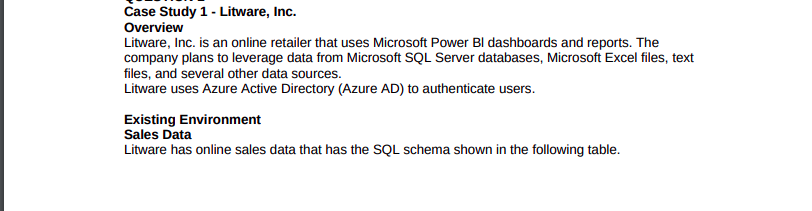
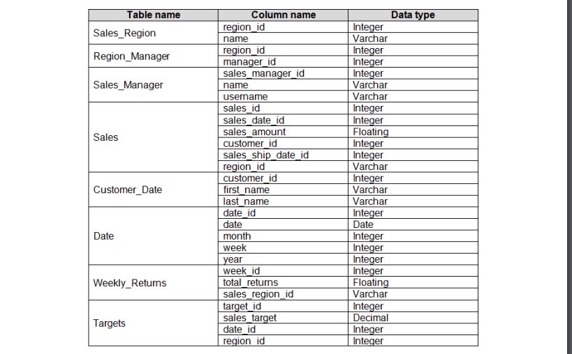
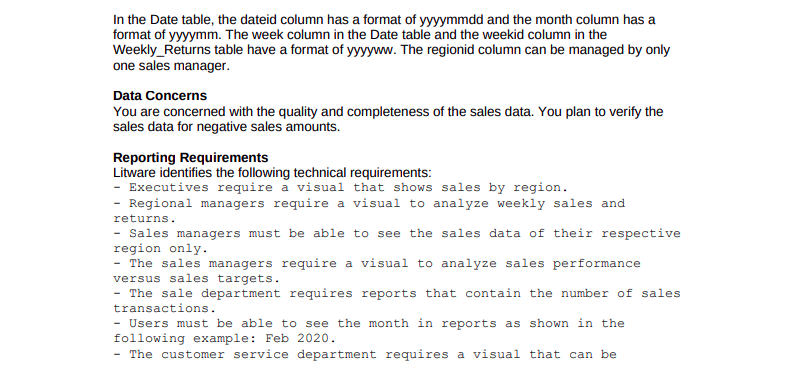
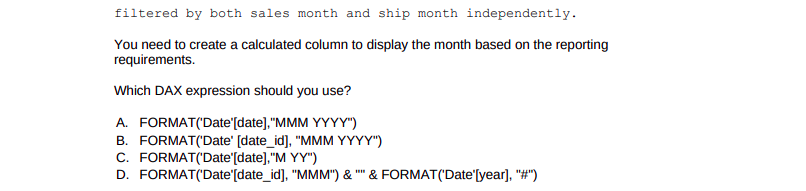

<h2 style="color: #193967; text-align: center">
    data science assesment 01
</h2>

<h4 style="color: #193967; text-align: center">
    Kabelo Masemola < kabelo.masemola@sambe.co.za>
</h4>

## Question 1: DA 100 
### Case Study 1 - Liteware,inc 

#### Overview:

 
 
 
 

## Question 2:

1. What is the columnar data tool used to analyze data in python? 
2. Given an object instance `df` compute a descriptive stats? 
3. Get five top rows 
4. Mention the different types of Data Structures in Pandas?
5. Define Series in Pandas?
6.  How can we calculate the standard deviation from the Series?

## Question 3:
1.What’s the trade-off between bias and variance?
2.What is the difference between supervised and unsupervised machine learning?
3. How is KNN different from k-means clustering?
4.  Define precision and recall.?
5. What is Bayes’ Theorem? How is it useful in a machine learning context?
6. Why is “Naive” Bayes naive?

## Question 4 
1.  What is DBMS?
2.  What is RDBMS?
3.  What is SQL?
4.  What is a primary key?
5.  What is a unique key?
6.  What is a foreign key?
7.  What are the types of join and explain each?
8.  What is normalization?
9.  What is Denormalization?
10. What are all the different normalizations?
11. What is a View?
12. Write a SQL query to get the third-highest salary of an employee from employee_table?

## Question 5 
1. What is a distributed system? 
2. Formalize the concept resiliency? 
3. list challenges of distributed systems?

## Results 
1. Kabelo Serame :
2. Phindiwe Ndaba:
3. Lerato riba: 
4. Pfarelo Raliphada : 
5. Ntombifuthi Sibangoni : 

